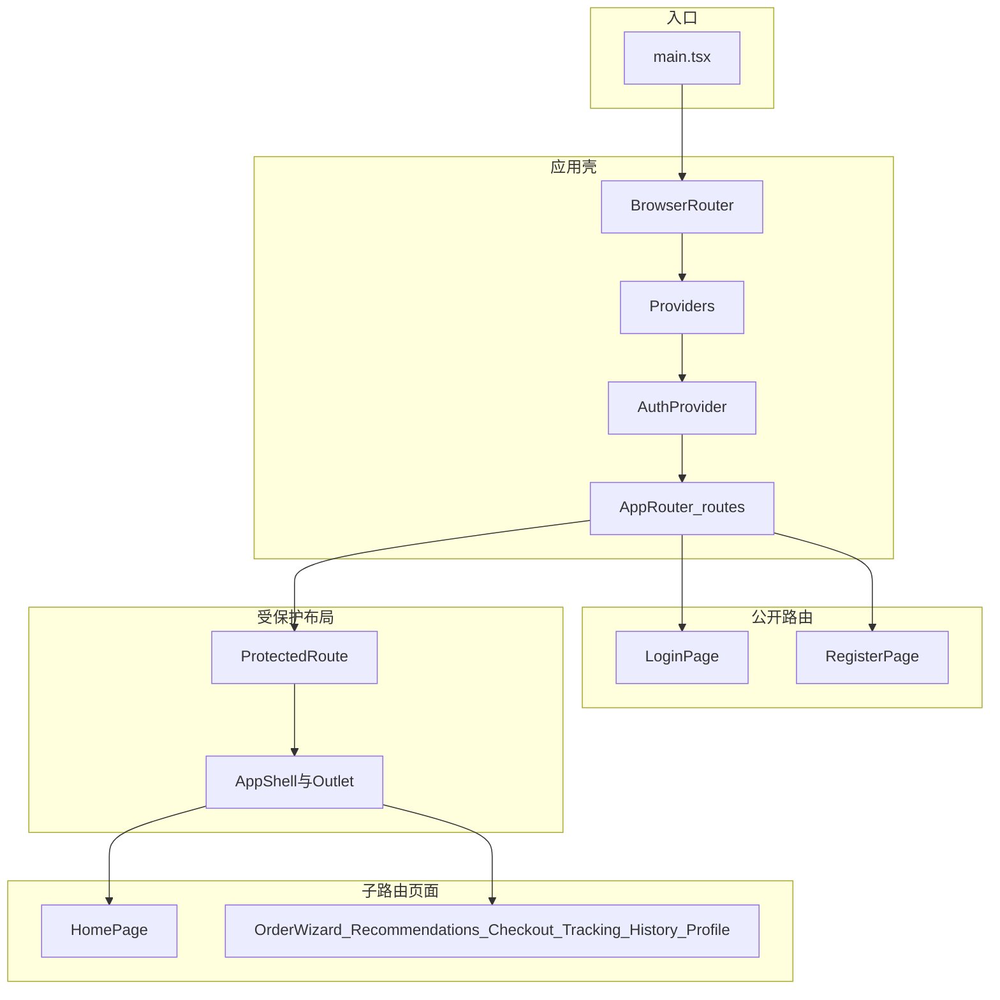

# UI Product Backlog：调度与交付管理应用

> 技术栈：**React** + **Ant Design** + **TypeScript**。业务组件以 Ant Design 组合为主；地图、Stripe、OAuth、推送等用薄封装或 `hooks/` + `services/` 承担。  
> 关联文档：[ProductBacklog.md](ProductBacklog.md)、[SprintReleasePlan.md](SprintReleasePlan.md)。  
> **前端工程目录：** [frontend/](frontend/)（Vite 脚手架，`src/` 结构与下文「建议源码落点」一致）。

---

## 优先级与冲刺说明

| 优先级 | 标签   | 说明                         |
| ------ | ------ | ---------------------------- |
| P0     | 必须有 | MVP，冲刺 1–5 必须完成       |
| P1     | 应该有 | 冲刺 6–7                     |
| P2     | 不错有 | 冲刺 8                       |

**建议源码落点：** `pages/`（路由页）、`features/`（领域智能组件）、`components/layout` & `components/common`（复用块）。

---

## 前端架构设计（`frontend/`）

### 分层职责

| 层级 | 路径 | 职责 |
|------|------|------|
| **应用入口** | `main.tsx` | 挂载根节点；挂载 `BrowserRouter`、`Providers`、`AuthProvider`、`AppRouter`。 |
| **应用壳** | `app/` | `router.tsx` 声明路由与 MVP 路径；`providers.tsx` 提供 Ant Design `ConfigProvider`（主题、中文）、`App` 容器。 |
| **路由页面** | `pages/` | 薄页面：按 URL 组装 `features/` 与 `components/`，不写复杂业务逻辑。 |
| **领域功能** | `features/` | 按史诗划分的智能组件（表单流、列表、地图区等），内含局部状态与后续 API 调用。当前以各域 `index.ts` 占位，随 UI Backlog 逐项落地为具体组件。 |
| **通用 UI** | `components/` | `layout`（`AppShell`）、`common`（加载/空状态等）、`auth`（`ProtectedRoute`）等跨页面复用块。 |
| **横切状态** | `context/` | 全局会话等（如 `AuthContext`）。 |
| **主题** | `theme/` | Ant Design `ThemeConfig`，与设计系统 token 对齐。 |
| **基础设施** | `hooks/`、`services/`、`types/`、`assets/` | 自定义 Hook、API/Maps/Stripe 封装、类型与静态资源。 |

**依赖方向（约定）：** `pages` → 可依赖 `features`、`components`、`hooks`、`services`、`context`；`features` → 可依赖 `components`、`hooks`、`services`、`types`；`components`（layout/common）→ 避免依赖 `pages` 与具体 `features`，保持可复用。

### `frontend/` 目录结构（与仓库一致）

下列树状结构反映当前工程布局；新增 UI Backlog 项时，优先落在对应 `features/<域>/` 或 `pages/<模块>/`。

```text
frontend/
├── index.html
├── package.json
├── vite.config.ts
├── tsconfig.json
├── tsconfig.app.json
├── tsconfig.node.json
└── src/
    ├── main.tsx                 # 入口：Router + Providers + Auth
    ├── vite-env.d.ts
    ├── app/
    │   ├── router.tsx           # React Router 路由表（公开 / 受保护布局）
    │   └── providers.tsx       # ConfigProvider、antd 中文、App 容器
    ├── pages/
    │   ├── HomePage.tsx
    │   ├── auth/
    │   │   ├── LoginPage.tsx
    │   │   └── RegisterPage.tsx
    │   ├── order/
    │   │   └── OrderWizardPage.tsx
    │   ├── checkout/
    │   │   ├── RecommendationsPage.tsx
    │   │   ├── CheckoutReviewPage.tsx
    │   │   ├── PaymentPage.tsx
    │   │   └── OrderConfirmationPage.tsx
    │   ├── tracking/
    │   │   └── TrackingPage.tsx
    │   ├── history/
    │   │   └── OrderHistoryPage.tsx
    │   └── profile/
    │       └── ProfilePage.tsx
    ├── features/                # 按领域扩展（当前多为占位，待拆组件）
    │   ├── auth/index.ts
    │   ├── address/index.ts
    │   ├── package/index.ts
    │   ├── recommendations/index.ts
    │   ├── checkout/index.ts
    │   ├── tracking/index.ts
    │   ├── history/index.ts
    │   └── postDelivery/index.ts
    ├── components/
    │   ├── layout/
    │   │   └── AppShell.tsx     # 侧栏 + 顶栏 + <Outlet />
    │   ├── common/
    │   │   └── PageLoading.tsx
    │   └── auth/
    │       └── ProtectedRoute.tsx
    ├── context/
    │   └── AuthContext.tsx
    ├── theme/
    │   └── antdTheme.ts
    ├── hooks/index.ts
    ├── services/index.ts
    ├── types/index.ts
    └── assets/
```

### 运行时结构（示意）



### 页面与功能落位关系

- **路由定义：** 一律在 `app/router.tsx` 维护，与 **[11. MVP 路由建议](#11-mvp-路由建议)** 对齐。
- **Backlog 实现：** `UIBacklog` 中的「页面/组件」列优先对应 `pages/` 与 `features/` 下的具体文件；横切能力放在 `components/common` 或 `hooks/` / `services/`。

---

## 1. 认证与账户（史诗 1）

### UI-AUTH-01 — 注册页（含 OTP 步骤）

| 字段           | 内容                                                                 |
| -------------- | -------------------------------------------------------------------- |
| **ID**         | UI-AUTH-01                                                           |
| **优先级**     | P0                                                                   |
| **目标冲刺**   | 1                                                                    |
| **用户故事**   | US-1.1                                                               |
| **页面/组件**  | `pages/auth/RegisterPage.tsx`；`features/auth/RegisterForm.tsx` 等   |
| **Ant Design** | `Form`, `Input`, `Button`, `Steps`, `message`                        |
| **验收要点**   | 全名、邮箱/手机、密码；OTP 确认；重复账户清晰错误；与注册 API 联调。 |

### UI-AUTH-02 — 登录页与错误态

| 字段           | 内容                                                         |
| -------------- | ------------------------------------------------------------ |
| **ID**         | UI-AUTH-02                                                   |
| **优先级**     | P0                                                           |
| **目标冲刺**   | 1                                                            |
| **用户故事**   | US-1.2                                                       |
| **页面/组件**  | `pages/auth/LoginPage.tsx`；`features/auth/LoginForm.tsx`    |
| **Ant Design** | `Form`, `Input.Password`, `Alert`, `message`               |
| **验收要点**   | 邮箱/手机 + 密码登录；错误凭证有意义提示；JWT 会话与路由守卫。 |

### UI-AUTH-03 — 应用外壳（导航 + 路由出口）

| 字段           | 内容                                                                 |
| -------------- | -------------------------------------------------------------------- |
| **ID**         | UI-AUTH-03                                                           |
| **优先级**     | P0                                                                   |
| **目标冲刺**   | 1                                                                    |
| **用户故事**   | 冲刺 1 导航任务                                                    |
| **页面/组件**  | `components/layout/AppShell.tsx`；顶栏/侧栏 `MainNav`                |
| **Ant Design** | `Layout`, `Menu`                                                     |
| **验收要点**   | 登录后主导航可切换下单、历史等；`Outlet` 渲染子路由。                |

### UI-AUTH-04 — 社交登录区（按钮 + 回调）

| 字段           | 内容                                                                |
| -------------- | ------------------------------------------------------------------- |
| **ID**         | UI-AUTH-04                                                          |
| **优先级**     | P1                                                                  |
| **目标冲刺**   | 6                                                                   |
| **用户故事**   | US-1.3                                                              |
| **页面/组件**  | `features/auth/SocialLoginButtons.tsx`；可选 `OAuthCallbackPage`    |
| **Ant Design** | `Button`, `Divider`                                                 |
| **验收要点**   | Google / Apple 入口；重定向与首登建账；错误态可理解。               |

### UI-AUTH-05 — 资料编辑页

| 字段           | 内容                                                         |
| -------------- | ------------------------------------------------------------ |
| **ID**         | UI-AUTH-05                                                   |
| **优先级**     | P1                                                           |
| **目标冲刺**   | 6                                                            |
| **用户故事**   | US-1.4                                                       |
| **页面/组件**  | `pages/profile/ProfilePage.tsx`；`features/auth/ProfileForm`  |
| **Ant Design** | `Form`, `Input`, `Button`                                    |
| **验收要点**   | 编辑姓名、手机、邮箱；保存后立即生效反馈。                   |

### UI-AUTH-06 — 访客结账入口与限制提示

| 字段           | 内容                                                                 |
| -------------- | -------------------------------------------------------------------- |
| **ID**         | UI-AUTH-06                                                           |
| **优先级**     | P2                                                                   |
| **目标冲刺**   | 8                                                                    |
| **用户故事**   | US-1.5                                                               |
| **页面/组件**  | 结账流分支；`Alert` / `Typography` 说明无历史访问                    |
| **Ant Design** | `Alert`, `Form`, `Steps`                                             |
| **验收要点**   | 仅姓名+手机/邮箱；会话结束后不可访问订单历史（与后端策略一致）。     |

---

## 2. 地址与位置（史诗 2）

### UI-ADDR-01 — 取/送货地址自动完成

| 字段           | 内容                                                                 |
| -------------- | -------------------------------------------------------------------- |
| **ID**         | UI-ADDR-01                                                           |
| **优先级**     | P0                                                                   |
| **目标冲刺**   | 2                                                                    |
| **用户故事**   | US-2.1                                                               |
| **页面/组件**  | `features/address/AddressAutocompleteField.tsx`                      |
| **Ant Design** | `AutoComplete` 或 `Select` + 自定义；配合 Maps Places                |
| **验收要点**   | 集成地图 API；≥3 字符触发建议；取货/送货两套字段。                   |

### UI-ADDR-02 — 服务区域外 Alert

| 字段           | 内容                                                         |
| -------------- | ------------------------------------------------------------ |
| **ID**         | UI-ADDR-02                                                   |
| **优先级**     | P0                                                           |
| **目标冲刺**   | 2                                                            |
| **用户故事**   | US-2.2                                                       |
| **页面/组件**  | `components/common/ServiceAreaAlert.tsx` 或内联于地址步骤    |
| **Ant Design** | `Alert`, `banner` 样式                                       |
| **验收要点**   | 超出 SF 边界立即横幅提示；与地理围栏 API 一致。              |

### UI-ADDR-03 — 地址簿与快捷选择

| 字段           | 内容                                                         |
| -------------- | ------------------------------------------------------------ |
| **ID**         | UI-ADDR-03                                                   |
| **优先级**     | P1                                                           |
| **目标冲刺**   | 6                                                            |
| **用户故事**   | US-2.3                                                       |
| **页面/组件**  | `features/address/AddressBookPicker.tsx`                   |
| **Ant Design** | `List`, `Card`, `Tag`, `Modal`                               |
| **验收要点**   | 保存/标记地址；订单表单可一键选用。                          |

### UI-ADDR-04 —「使用我的位置」与逆地理展示

| 字段           | 内容                                                         |
| -------------- | ------------------------------------------------------------ |
| **ID**         | UI-ADDR-04                                                   |
| **优先级**     | P1                                                           |
| **目标冲刺**   | 6                                                            |
| **用户故事**   | US-2.4                                                       |
| **页面/组件**  | `features/address/UseMyLocationButton.tsx`                   |
| **Ant Design** | `Button`, `Typography`                                       |
| **验收要点**   | 浏览器 Geolocation；权限拒绝提示；逆地理编码可读地址回填。   |

---

## 3. 包裹详情（史诗 3）

### UI-PKG-01 — 尺寸卡片 + 重量输入

| 字段           | 内容                                                         |
| -------------- | ------------------------------------------------------------ |
| **ID**         | UI-PKG-01                                                    |
| **优先级**     | P0                                                           |
| **目标冲刺**   | 2                                                            |
| **用户故事**   | US-3.1                                                       |
| **页面/组件**  | `features/package/PackageSizeCards.tsx`；`WeightInput.tsx`   |
| **Ant Design** | `Card`, `Radio` / `Row` `Col`, `InputNumber`                 |
| **验收要点**   | 小/中视觉图标；超重排除无人机（与推荐联动）。                |

### UI-PKG-02 — 易碎 Switch

| 字段           | 内容                                                         |
| -------------- | ------------------------------------------------------------ |
| **ID**         | UI-PKG-02                                                    |
| **优先级**     | P1                                                           |
| **目标冲刺**   | 6                                                            |
| **用户故事**   | US-3.2                                                       |
| **页面/组件**  | `features/package/FragileSwitch.tsx`                         |
| **Ant Design** | `Switch`, `Form.Item`                                        |
| **验收要点**   | 易碎影响推荐（无人机降权）；状态提交后端。                   |

### UI-PKG-03 — 交付说明 TextArea

| 字段           | 内容                                                         |
| -------------- | ------------------------------------------------------------ |
| **ID**         | UI-PKG-03                                                    |
| **优先级**     | P1                                                           |
| **目标冲刺**   | 6                                                            |
| **用户故事**   | US-3.3                                                       |
| **页面/组件**  | `features/package/DeliveryNotesField.tsx`                    |
| **Ant Design** | `Input.TextArea`, `showCount`, `maxLength={200}`           |
| **验收要点**   | ≤200 字；确认页与跟踪页可见备注。                            |

---

## 4. 下单流程

### UI-ORD-01 — 多步骤订单向导

| 字段           | 内容                                                                 |
| -------------- | -------------------------------------------------------------------- |
| **ID**         | UI-ORD-01                                                            |
| **优先级**     | P0                                                                   |
| **目标冲刺**   | 2                                                                    |
| **用户故事**   | US-2.x / US-3.1 组合                                                 |
| **页面/组件**  | `pages/order/OrderWizardPage.tsx`；步骤：地址 → 包裹 → 选项占位      |
| **Ant Design** | `Steps`, `Form`, `Button`                                            |
| **验收要点**   | 三步可前进/后退；状态可带到推荐页；区域外横幅与包裹校验可见。        |

---

## 5. 推荐引擎展示（史诗 4）

### UI-REC-01 — 交付选项卡片（徽章）

| 字段           | 内容                                                                 |
| -------------- | -------------------------------------------------------------------- |
| **ID**         | UI-REC-01                                                            |
| **优先级**     | P0                                                                   |
| **目标冲刺**   | 3                                                                    |
| **用户故事**   | US-4.2                                                               |
| **页面/组件**  | `features/recommendations/DeliveryOptionCard.tsx`；列表容器          |
| **Ant Design** | `Card`, `Tag` / `Badge`, `Typography`, `Space`                       |
| **验收要点**   | 机器人 vs 无人机；最快/最便宜/最佳标签；ETA 与价格展示。             |

### UI-REC-02 — 不可用态 + Tooltip

| 字段           | 内容                                                         |
| -------------- | ------------------------------------------------------------ |
| **ID**         | UI-REC-02                                                    |
| **优先级**     | P0                                                           |
| **目标冲刺**   | 3                                                            |
| **用户故事**   | US-4.3                                                       |
| **页面/组件**  | 与 UI-REC-01 组合；`Tooltip`                                 |
| **Ant Design** | `Card` disabled 样式, `Tooltip`, `Badge`                   |
| **验收要点**   | 无车时灰显；“当前不可用”与原因可悬停查看。                   |

### UI-REC-03 — 天气警告徽章（无人机）

| 字段           | 内容                                                         |
| -------------- | ------------------------------------------------------------ |
| **ID**         | UI-REC-03                                                    |
| **优先级**     | P2                                                           |
| **目标冲刺**   | 8                                                            |
| **用户故事**   | US-4.4                                                       |
| **页面/组件**  | `features/recommendations/WeatherWarningBadge.tsx`           |
| **Ant Design** | `Alert`, `Tag`, `Tooltip`                                    |
| **验收要点**   | 恶劣天气警告或禁用无人机；与后端天气逻辑一致。               |

---

## 6. 结账与支付（史诗 5）

### UI-PAY-01 — 订单摘要审查

| 字段           | 内容                                                         |
| -------------- | ------------------------------------------------------------ |
| **ID**         | UI-PAY-01                                                    |
| **优先级**     | P0                                                           |
| **目标冲刺**   | 4                                                            |
| **用户故事**   | US-5.1                                                       |
| **页面/组件**  | `pages/checkout/CheckoutReviewPage.tsx`；`OrderReviewSummary`  |
| **Ant Design** | `Descriptions`, `Card`, `Button` 返回编辑                    |
| **验收要点**   | 展示地址、包裹、车型、ETA、费用；可导航回前序步骤修改。      |

### UI-PAY-02 — Stripe 支付区

| 字段           | 内容                                                         |
| -------------- | ------------------------------------------------------------ |
| **ID**         | UI-PAY-02                                                    |
| **优先级**     | P0                                                           |
| **目标冲刺**   | 4                                                            |
| **用户故事**   | US-5.2                                                       |
| **页面/组件**  | `pages/checkout/PaymentPage.tsx`；`features/checkout/StripeCardSection.tsx` |
| **Ant Design** | `Card`, `Spin`, `Result`                                     |
| **验收要点**   | Stripe Elements；测试模式；成功/失败反馈。                   |

### UI-PAY-03 — 订单确认页

| 字段           | 内容                                                         |
| -------------- | ------------------------------------------------------------ |
| **ID**         | UI-PAY-03                                                    |
| **优先级**     | P0                                                           |
| **目标冲刺**   | 4                                                            |
| **用户故事**   | US-5.3（确认屏）                                             |
| **页面/组件**  | `pages/checkout/OrderConfirmationPage.tsx`                   |
| **Ant Design** | `Result`, `Button`, `Typography`                             |
| **验收要点**   | 唯一订单 ID、ETA、「跟踪我的交付」CTA。                      |

### UI-PAY-04 — 促销码

| 字段           | 内容                                                         |
| -------------- | ------------------------------------------------------------ |
| **ID**         | UI-PAY-04                                                    |
| **优先级**     | P1                                                           |
| **目标冲刺**   | 7                                                            |
| **用户故事**   | US-5.3（促销）                                               |
| **页面/组件**  | `features/checkout/PromoCodeField.tsx`                       |
| **Ant Design** | `Input`, `Button`, `Form`, `Statistic` / `Text`              |
| **验收要点**   | 有效码扣减总价；无效码错误提示。                             |

### UI-PAY-05 — Apple / Google Pay 入口

| 字段           | 内容                                                         |
| -------------- | ------------------------------------------------------------ |
| **ID**         | UI-PAY-05                                                    |
| **优先级**     | P2                                                           |
| **目标冲刺**   | 8                                                            |
| **用户故事**   | US-5.4                                                       |
| **页面/组件**  | `features/checkout/WalletPayButtons.tsx`                       |
| **Ant Design** | `Space`, `Button`                                            |
| **验收要点**   | 调起原生钱包 UI；与后端支付意图配合。                        |

---

## 7. 实时跟踪（史诗 6）

### UI-TRK-01 — 实时地图 + 车辆动画

| 字段           | 内容                                                         |
| -------------- | ------------------------------------------------------------ |
| **ID**         | UI-TRK-01                                                    |
| **优先级**     | P0                                                           |
| **目标冲刺**   | 5                                                            |
| **用户故事**   | US-6.1                                                       |
| **页面/组件**  | `pages/tracking/TrackingPage.tsx`；`features/tracking/LiveMapView.tsx` |
| **Ant Design** | `Spin`, `Card`                                               |
| **验收要点**   | 路线与车辆标记；动画/轮询或 WS；ETA 更新展示。               |

### UI-TRK-02 — PIN / 二维码展示

| 字段           | 内容                                                         |
| -------------- | ------------------------------------------------------------ |
| **ID**         | UI-TRK-02                                                    |
| **优先级**     | P0                                                           |
| **目标冲刺**   | 5                                                            |
| **用户故事**   | US-6.2                                                       |
| **页面/组件**  | `features/tracking/PinOrQrDisplay.tsx`                         |
| **Ant Design** | `Card`, `Typography`, `QRCode`（antd）                         |
| **验收要点**   | 唯一 4 位 PIN 或 QR；跟踪页醒目展示。                        |

### UI-TRK-03 — 订单状态进度

| 字段           | 内容                                                         |
| -------------- | ------------------------------------------------------------ |
| **ID**         | UI-TRK-03                                                    |
| **优先级**     | P0                                                           |
| **目标冲刺**   | 5                                                            |
| **用户故事**   | 冲刺 5 交付物                                                |
| **页面/组件**  | `features/tracking/OrderStatusSteps.tsx`                     |
| **Ant Design** | `Steps` 或 `Timeline`                                        |
| **验收要点**   | 五阶段状态与当前步高亮。                                     |

### UI-TRK-04 — 推送相关 UI

| 字段           | 内容                                                         |
| -------------- | ------------------------------------------------------------ |
| **ID**         | UI-TRK-04                                                    |
| **优先级**     | P1                                                           |
| **目标冲刺**   | 7                                                            |
| **用户故事**   | US-6.3                                                       |
| **页面/组件**  | 权限引导 `Alert` / `Modal`；可选设置页开关                   |
| **Ant Design** | `Alert`, `Modal`, `Switch`                                  |
| **验收要点**   | 与 FCM/APNs 集成说明一致；用户可理解何时会收到提醒。         |

### UI-TRK-05 — 交付照片展示

| 字段           | 内容                                                         |
| -------------- | ------------------------------------------------------------ |
| **ID**         | UI-TRK-05                                                    |
| **优先级**     | P1                                                           |
| **目标冲刺**   | 7                                                            |
| **用户故事**   | US-6.4                                                       |
| **页面/组件**  | `features/tracking/DeliveryPhotoGallery.tsx`                   |
| **Ant Design** | `Image`, `Card`                                              |
| **验收要点**   | 跟踪页与历史详情可见上传照片。                               |

---

## 8. 历史与交付后（史诗 7）

### UI-HIST-01 — 订单历史列表

| 字段           | 内容                                                         |
| -------------- | ------------------------------------------------------------ |
| **ID**         | UI-HIST-01                                                   |
| **优先级**     | P0                                                           |
| **目标冲刺**   | 5                                                            |
| **用户故事**   | US-7.1                                                       |
| **页面/组件**  | `pages/history/OrderHistoryPage.tsx`；`OrderHistoryList`     |
| **Ant Design** | `Table` 或 `List`, `Tag`                                     |
| **验收要点**   | 订单 ID、日期、状态、总费用；可跳转详情/跟踪。               |

### UI-HIST-02 — 交付后评分

| 字段           | 内容                                                         |
| -------------- | ------------------------------------------------------------ |
| **ID**         | UI-HIST-02                                                   |
| **优先级**     | P1                                                           |
| **目标冲刺**   | 7                                                            |
| **用户故事**   | US-7.2                                                       |
| **页面/组件**  | `features/postDelivery/RatingPrompt.tsx`                     |
| **Ant Design** | `Modal` / `Drawer`, `Rate`, `Button`                         |
| **验收要点**   | 已交付后触发；1–5 星提交 API。                               |

### UI-HIST-03 — 报告问题表单

| 字段           | 内容                                                         |
| -------------- | ------------------------------------------------------------ |
| **ID**         | UI-HIST-03                                                   |
| **优先级**     | P1                                                           |
| **目标冲刺**   | 7                                                            |
| **用户故事**   | US-7.3                                                       |
| **页面/组件**  | `features/postDelivery/ReportIssueForm.tsx`                  |
| **Ant Design** | `Form`, `Select`, `Input.TextArea`, `Modal`                  |
| **验收要点**   | 问题类别 + 描述；提交生成工单反馈。                          |

### UI-HIST-04 — 碳足迹卡片

| 字段           | 内容                                                         |
| -------------- | ------------------------------------------------------------ |
| **ID**         | UI-HIST-04                                                   |
| **优先级**     | P2                                                           |
| **目标冲刺**   | 8                                                            |
| **用户故事**   | US-7.4                                                       |
| **页面/组件**  | `features/postDelivery/CarbonFootprintCard.tsx`              |
| **Ant Design** | `Card`, `Statistic`, `Typography`                          |
| **验收要点**   | 相对燃油货车的 CO₂ 节省展示；数据与后端一致。                |

---

## 9. 横切

### UI-X-01 — 全局加载、空状态、错误边界

| 字段           | 内容                                                         |
| -------------- | ------------------------------------------------------------ |
| **ID**         | UI-X-01                                                      |
| **优先级**     | P0（基线）/ 持续打磨至 P2                                      |
| **目标冲刺**   | 0–8                                                          |
| **用户故事**   | 工程质量与 Sprint 8 UI 打磨                                  |
| **页面/组件**  | `components/common/PageLoading.tsx`；`EmptyState.tsx`；`RouteErrorBoundary` |
| **Ant Design** | `Spin`, `Skeleton`, `Empty`, `Result`                        |
| **验收要点**   | 列表/页面级骨架；网络错误可重试；错误边界不白屏。            |

---

## 10. 组件数量级（与企划一致）

| 范围        | 页面 (`pages/`) | 可复用组件（`features/` + `components/`） |
| ----------- | --------------- | ----------------------------------------- |
| P0（MVP）   | 约 12–14        | 约 22–28                                  |
| +P1         | +少量           | +约 10–14                                 |
| +P2         | +少量           | +约 5–8                                   |
| **全产品**  | **约 12–14**    | **约 40–50**（命名文件级，可随团队调整）  |

---

## 11. MVP 路由建议

`/login` → `/register` → `/`（首页）→ `/order`（向导）→ `/recommendations` → `/checkout` → `/checkout/pay` → `/checkout/confirmation` → `/orders/:orderId/tracking` → `/history`

（具体路径以实现为准；需保护路由仅登录可访问，认证页除外。）
