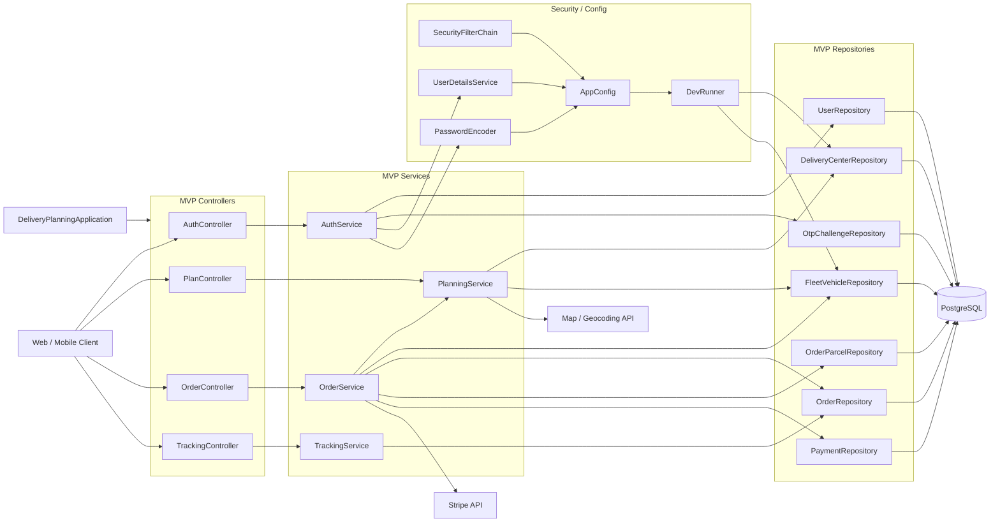
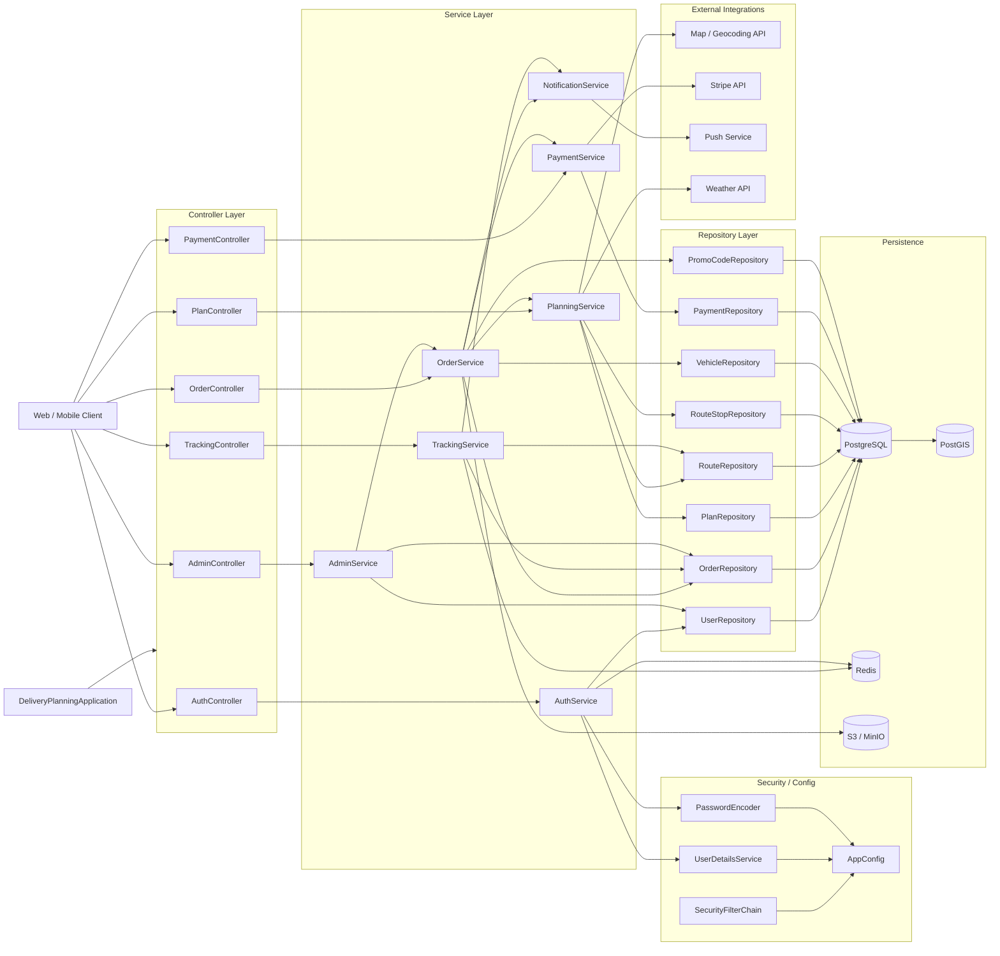
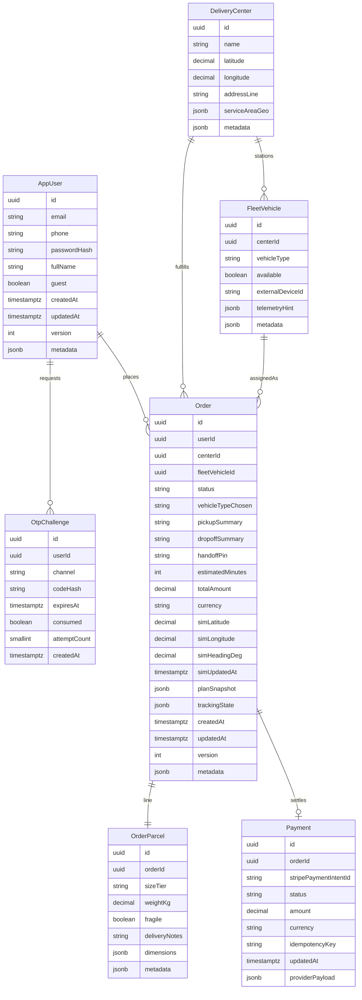

# Java 后端分层架构与数据库 ER（自治配送 · MVP 优先）

本文档描述团队在 **Java（Spring Boot）+ PostgreSQL** 下的后端结构，与 **OnlineOrder** 类项目（Controller → Service → Repository）对齐。**排版图以 [ProductBacklog.md](ProductBacklog.md) 中的 P0（可发布 MVP）为准**：下文 **§2** 的分层图与 **§3** 的 ER 图均为 **MVP 简要版**。完全版（目标态、含 P1/P2）仅在对应**子标题**中做宏观对照，便于今后扩容，**当前 Sprint 与估点请以上述 MVP 范围为准**。

---

## 1. 团队决议摘要

- **运行时**：Java，建议 **Spring Boot** 作为 Web 与依赖注入容器。
- **主库**：**PostgreSQL**；服务区域与距离可采用 **PostGIS** 几何列，或在应用层用规则/经纬度实现（与 [BackendTechStackDiscussion.md](BackendTechStackDiscussion.md) 一致）。
- **分层约定**：HTTP 入口仅落在 **Controller**；业务规则与编排落在 **Service**；持久化仅通过 **Repository** 访问数据库。
- **外部系统**：支付、地图、天气、推送、对象存储等与业务服务协作，**不**下沉到 Repository 层直接调用。

---

## 2. 分层架构（MVP）

### 2.1 MVP 端到端结构图（任务拆分用）

下图覆盖 **P0**（至冲刺 5、可发布 MVP）：认证、地址与围栏、包裹尺寸/重量、推荐与可用车辆、结账与 Stripe、地图跟踪与 PIN、订单历史。**不包含**：促销码（P1）、推送（P1）、交付照片与对象存储（P1）、天气（P2）、**AdminController** 用户面、**NotificationService**、**PaymentController** 独立拆分（支付编排并入 **OrderService** 与同套 **OrderController** 路由）。实现时可在包内继续拆分私有类，不必与图中每个框一一对应。

**MVP 持久化说明**：仅 **PostgreSQL**；服务区域与距离可在库侧用 **PostGIS**，或由 **PlanningService** 用经纬度规则实现。**不画** `PlanRepository` / `RouteRepository` / `RouteStopRepository` 表示 MVP 阶段路线与方案多在服务内计算并写入 **Order** 的可空列或 JSON 字段；若后续与目标态对齐再落独立表（见 **§2.3**）。

### 2.2 MVP 各块职责与任务分配（示例）

「负责人」列为占位，冲刺规划会上填写。

| Block | MVP 职责（对齐 P0） | 主要用户故事 | 可分配任务示例 | 负责人 |
|-------|---------------------|--------------|----------------|--------|
| **AuthController / AuthService** | 注册、登录、OTP、密码哈希、JWT 颁发与校验入口；衔接 **UserDetailsService** / **PasswordEncoder** | US-1.1、US-1.2 | Sprint 1：注册/登录 API + 集成测试骨架 | |
| **PlanController / PlanningService** | 取/送货地址校验、旧金山服务区域判断；包裹尺寸与重量校验；三中心距离与车队可用性、ETA/定价选项（机器人 vs 无人机） | US-2.1、US-2.2、US-3.1、US-4.1–US-4.3 | Sprint 2–3：围栏与推荐 API；对接地图 API（服务端校验/缓存策略） | |
| **OrderController / OrderService** | 订单摘要、创建订单、**Stripe 支付意图与 Webhook（MVP 路由挂在 Order 面）**、支付成功后落单、订单历史列表 | US-5.1、US-5.2、US-7.1 | Sprint 4–5：结账与支付管道、订单 ID 与历史查询 | |
| **TrackingController / TrackingService** | 订单履约状态、**模拟**车辆位置流（或轮询）、**handoff PIN** 生成与读取 | US-6.1、US-6.2 | Sprint 5：跟踪 API + 与前端地图联调 | |
| **MVP Repositories** | 仅访问：用户、OTP、中心、车队、订单、包裹、支付 | （支撑上述故事） | Sprint 0–1：实体与迁移与种子数据对齐 | |
| **Security / Config** | **SecurityFilterChain**、JWT 过滤器（若采用）、**AppConfig** | 横切 | Sprint 0：安全骨架与开发配置 | |
| **DevRunner** | 启动时或 profile=dev 下写入 **三配送中心 + 模拟车辆库存** | 冲刺 0 种子 | Sprint 0：与 **DeliveryCenterRepository**、**FleetVehicleRepository** 对接 | |

**MVP 范围外（不必在本阶段排进架构图主体）**：`PaymentController` 独立拆分、`AdminController`、`NotificationService`、**Redis**、**S3/MinIO**、**Weather**、**Push**、**PromoCodeRepository**、常用地址表（US-2.3，P1）等。

### 2.3 对照：目标态（完全版）宏观设计

以下内容为**宏观对照**，描述产品走完整 journey 时的**扩展方向**；**实施顺序与包结构仍以 §2.1–2.2 的 MVP 为准**。

- **控制面变宽**：从四个 MVP Controller 扩展到含 **PaymentController**、**AdminController**；支付编排可从 **OrderService** 拆出独立 **PaymentService**。
- **出站能力**：引入 **NotificationService**（推送 FCM/APNs），由订单/跟踪链路触发（P1）。
- **持久化面**：除 MVP 七表外，可落 **Plan / Route / RouteStop** 等仓储与对应表；**VehicleRepository** 与 **FleetVehicleRepository** 的边界可按团队建模统一。
- **横切基础设施**：**Redis**（会话、OTP 限流、热点轨迹缓存）、**S3/MinIO**（交付照片 URL）、**PostGIS** 与更多 **External**（天气 P2）由 Service 编排，不进入 Repository 直连外部。

完全版端到端分层关系见下图（与 OnlineOrder 风格一致，含 P1/P2 扩展面）。

#### 目标态各组件职责速查（含 P1/P2）

| 组件 | 掌管范围（可再在内部分文件/私有类） |
|------|--------------------------------------|
| **AuthController → AuthService** | **身份与凭证**：注册、登录、OTP、JWT；与 **UserDetailsService**、**PasswordEncoder**、**AppConfig** 协同；可按需使用 **Redis** 做 OTP 限流或会话（非 MVP 必选）。 |
| **PlanController → PlanningService** | **下单前规划**：地址持久化与服务区域校验（US-2.x）、包裹约束（US-3.x）、推荐/报价与中心—车队只读（US-4.x）；编排 **地图 / 地理编码**、**天气**（P2）；可读写 **Plan / Route / RouteStop** 等仓储（路线落库时）。 |
| **OrderController → OrderService** | **订单与金额侧**：订单创建与状态、与 **PlanningService** 衔接方案、与 **PaymentService** 衔接支付；促销码（P1）、**通知**触发；读写订单、车辆占用、促销相关仓储。 |
| **PaymentController → PaymentService** | **支付网关**：Stripe 意图、确认与 Webhook、本地 **Payment** 记录；金额与幂等以服务端为准。 |
| **TrackingController → TrackingService** | **履约可视化**：轨迹查询与模拟推送、订单状态；可读 **Route** 等；**Redis** 可用于热点轨迹缓存；与 **NotificationService** 协作接近提醒（P1）。 |
| **AdminController → AdminService** | **运营/内部能力**：查询用户与订单、运维操作；**非用户 MVP 必经路径**。 |
| **NotificationService** | **出站通知**：推送（FCM/APNs）等；被 **OrderService** / **TrackingService** 调用（P1）。 |
| **Repository** | 按聚合根或表拆分；各 Service 只通过 Repository 访问 **PostgreSQL**（及可选 **PostGIS**）。 |
| **Security / Config** | **SecurityFilterChain**、**UserDetailsService**、**PasswordEncoder** 汇入 **AppConfig**；**DeliveryPlanningApplication** 为 Spring Boot 入口。 |
| **Persistence** | 主库 **PostgreSQL**；**PostGIS** 可选；**Redis**、**S3/MinIO** 为增强能力承载。 |
| **External Integrations** | 地图、Stripe、推送、天气等由对应 Service 编排，**不**在 Repository 内直连。 |

---

## 3. 数据库 ER 图（MVP）

本节为 **当前 MVP 落库模型**（与 **§2.1** 七个 Repository 一一对应）。字段可在实现阶段微调；地理信息可用 `latitude` / `longitude` 或 PostGIS `geometry`。

下图实体与 **§2.1 `mvpRepos`** 对齐：**UserRepository** → `app_user`，**OtpChallengeRepository** → `otp_challenge`，**DeliveryCenterRepository** → `delivery_center`，**FleetVehicleRepository** → `fleet_vehicle`，**OrderRepository** → `orders`（域模型 **Order**），**OrderParcelRepository** → `order_parcel`，**PaymentRepository** → `payment`。**TrackingService** 在 MVP 中只经 **OrderRepository** 读写履约与模拟位置，故轨迹与规划摘要落在 **订单表** 的可空列或 `planSnapshot` / `trackingState`（jsonb）；高频轨迹点表见 **§3.2** 目标态扩展。

### 3.1 MVP 实体字段概要（实现对照）

| 实体 | 主键 / 外键 | 关键业务字段 |
|------|-------------|----------------|
| **AppUser** | `id`；`email`/`phone` 唯一（可空策略与访客一致） | `passwordHash`、`guest`；`metadata` / `version` 预留 |
| **OtpChallenge** | `id`；`userId` 可空 | `codeHash`、`expiresAt`、`consumed`、`attemptCount` |
| **DeliveryCenter** | `id` | 三中心种子；`serviceAreaGeo` 预留围栏 |
| **FleetVehicle** | `id`；`centerId` → DeliveryCenter | `vehicleType`、`available`；`telemetryHint` 预留 |
| **Order** | `id`；`userId` 可空；`centerId`；`fleetVehicleId` 可空 | `status`、`vehicleTypeChosen`、`handoffPin`、`totalAmount`；`sim*` 模拟轨迹；`planSnapshot` / `trackingState` |
| **OrderParcel** | `id`；`orderId`（MVP 1:1，可演进 1:N） | `sizeTier`、`weightKg`、`fragile`、`deliveryNotes` |
| **Payment** | `id`；`orderId` 1:1 | `stripePaymentIntentId`、`status`；`idempotencyKey`、`providerPayload` 预留 |

### 3.2 对照：目标态扩展实体（P1/P2，迁移路径）

以下为**宏观清单**：**不**作为当前 ER 主图；与 MVP 共用同一 PostgreSQL 时，可通过后续迁移**加表/加列**对齐，无需推翻 MVP 七表。

| 实体 | 典型引入时机 | 关系/用途概要 |
|------|--------------|----------------|
| **OAuthLink** | P1+ | `userId` → AppUser；第三方登录 Subject |
| **SavedAddress** | P1（US-2.3） | `userId` → AppUser；常用地址 |
| **PromoCode** / **OrderPromoApplication** | P1（US-5.3） | 促销与订单抵扣关联 |
| **TrackingEvent** | P1+ | `orderId` → Order；高频轨迹点，替代订单列承载 |
| **Plan** / **Route** / **RouteStop** | 与 §2.3 路线落库一致 | 规划与可回放路线结构化存储 |
| **DeliveryProof** | P1（US-6.4） | 订单交付照片 URL |
| **Rating** | P1（US-7.2） | 订单评分 |
| **SupportTicket** | P1（US-7.3） | 客服工单 |

---

## 4. 与外部系统的边界（文字约定）

| 外部能力 | 典型集成点 | 说明 |
|----------|------------|------|
| **Stripe** | **目标态**：`PaymentService` + `PaymentController`；**MVP**：`OrderService`（`OrderController` 上支付与 Webhook 路由） | 支付意图、Webhook 签名校验、幂等；金额以服务端为准。 |
| **地图 / 地理编码** | `PlanningService` | 自动完成可在前端；服务端负责持久化与围栏校验（US-2.2）。 |
| **天气 API** | `PlanningService` 内客户端（P2） | 影响无人机可选性（US-4.4）。 |
| **推送 FCM/APNs** | `NotificationService`（P1），由 `OrderService` / `TrackingService` 触发 | 接近触发（US-6.3）。 |
| **对象存储** | `OrderService` 或独立交付服务（P1） | 照片预签名 URL，库中仅存 URL（US-6.4）。 |

---

## 5. 修订记录

| 版本 | 日期 | 说明 |
|------|------|------|
| 1.0 | 2026-03-24 | 初稿：Spring 分层图 + PostgreSQL ER 与字段概要 |
| 1.1 | 2026-03-24 | 全量架构改为 LR 图：Auth / Plan / Order / Tracking / Payment / Admin + Notification；Persistence 含 PostGIS、Redis、对象存储 |
| 1.2 | 2026-03-24 | 新增 §2.2 MVP 简版图与任务表；§2.1 与 §2 命名对齐；§3 集成点与 MVP/目标态区分 |
| 1.3 | 2026-03-24 | §2.2 新增「MVP 数据库 ER 图」四级标题：仅对齐七个 MVP Repository，含可扩展 jsonb / 模拟轨迹 / 可选载具外键 |
| 2.0 | 2026-03-24 | **文档以 MVP 为主叙事**：§2.1/§3 为正排版图与 ER；完全版分层与 P1/P2 实体移至 §2.3、§3.2 对照 |
